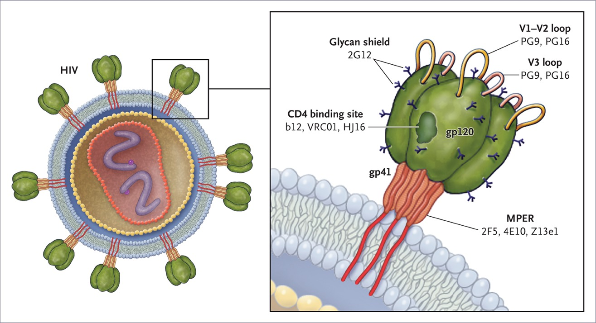

```{r xaringan-setup, include=FALSE, warning=FALSE}
library("xaringanthemer")

extra_css <- list(
  ".small" =  list(`font-size` = "80%"),
  ".large" =  list(`font-size` = "150%"),
  ".huge" =  list(`font-size` = "300%"),
  "ul li" = list(`margin-bottom` = "10px"),
  ".gray" = list(color = "#C0C0C0"),
  ".red" = list(color = "#FF0000"),
  ".blue1" = list(color = "#3AABBE"),
  ".blue2" = list(color = "#2A6D90"),
  ".blue3" = list(color = "#446874"),
  ".purple" = list(color = "#624474"),
  ".green" = list(color = "#348338"),
  ".mutedred" = list(color = "#745344"),
  "a" = list(color = "#3AABBE"),
  "a:hover" = list("text-decoration" = "underline")
)
# set up fonts
style_mono_accent(
  base_color = "#446874",
  header_font_google = google_font("DM Sans"),
  text_font_google   = google_font("DM Sans", "400", "400i"),
  code_font_google   = google_font("Courier Prime"),
  extra_css = extra_css
)

xaringanExtra::use_tile_view()
```

<style type="text/css">
.remark-slide-content {
    font-size: 20px;
    header-h2-font-size: 1.75rem;
}
</style>

## Research team

This work was done in collaboration with:
```{r acknowledgments, echo = FALSE, fig.show = "hold", out.width = "65%", fig.align = "center"}
knitr::include_graphics(c(
    "img/people1.PNG"
  ))
```
```{r acknowledgments-2, echo = FALSE, fig.show = "hold", out.width = "55%", fig.align = "center"}
knitr::include_graphics(c(
    "img/people2.PNG"
  ))
```

---

## Motivation: HIV envelope and antibody targets

```{r bnab-targets, echo = FALSE, out.width = "90%", fig.align = "center"}

```

.small[Source: Koff and Berkley (2010)]

---

## Motivation: AMP

AMP overall objective: assess .blue2[VRC01] .blue1[prevention efficacy] (PE) against HIV-1

* &zwj;VRC01: broadly neutralizing antibody (bnAb) isolated from donor

--

Key secondary question:

.green[Which genetic mutations] make HIV-1 .purple[susceptible] to neutralization?

--

&zwj;Challenges:
* How should we measure susceptibility?
--

* How do we determine if a mutation has a real effect?
--

 at .red[many] positions?
--

* Can we use .mutedred[machine learning]?

---

## Variable importance: what and why

**What is variable importance?**
* .blue1[Quantification of "contributions" of a variable] (or a set of variables)

--

  Traditionally: contribution to .blue2[predictions]
--

* Useful to distinguish between contributions of predictions...
--

  * (.blue1[extrinsic importance]) ... .blue1[by a given (possibly black-box) algorithm]
  .small[ [e.g., Breiman, (2001)] ]
--

  * (.blue1[intrinsic importance]) ... .blue1[by best possible (i.e., oracle) algorithm]
  .small[ [e.g., van der Laan (2006)] ]
--

* Our work focuses on .blue1[interpretable, model-agnostic intrinsic importance]

--

Example uses of .blue2[intrinsic] variable importance:
* is it worth extracting text from notes in the EHR for the sake of predicting hospital readmission?

--

* is it worth collecting a given covariate for the sake of predicting neutralization sensitivity?


---

## Case study: ANOVA importance

Data unit $(X, Y)$ with:
* outcome $Y$ 
* covariate $X := (X_1, X_2, \ldots, X_p)$

--

**Goals:** 
* .green[estimate]
* .blue1[and do inference on]

the importance of $(X_j: j \in s)$ in predicting $Y$

--

How do we typically do this in **linear regression**?

---

## Case study: ANOVA importance

How do we typically do this in **linear regression**?

* Fit a linear regression of $Y$ on $X$ $\rightarrow \color{magenta}{\hat{\mu}(X)}$
--

* Fit a linear regression of $Y$ on $X_{-s}$ $\rightarrow \color{magenta}{\hat{\mu}_s(X)}$
--

* .green[Compare the fitted values] $[\hat{\mu}(X_i), \hat{\mu}_s(X_i)]$

--

Many ways to compare fitted values, including:
* ANOVA decomposition
* Difference in $R^2$

--

Can extend this to a .blue1[nonparametric] measure using .blue2[population quantities] 

--

Can do .blue1[inference] on this parameter, even if we used .green[machine learning] 

.small[[details in Williamson et al. (2020a)]]

---

## A unified framework

Our proposed general framework for inference on *model-agnostic** variable importance:
--

1. Choose a .blue2[scientifically relevant] measure of .blue1[predictiveness] $V$

--

  * Large $V$ = good predictions
  * e.g., classification accuracy, AUC, $R^2$

--

2. Define variable importance as 

  $V($ .blue1[best possible] prediction function using .green[all variables] $) -$
  
  $V($ .blue1[best possible] prediction function .red[excluding the variables of interest] $)$

--

.blue1[Inference] possible even with machine learning! .small[ [Details in Williamson et al. (2020b)] ]

Implemented in `R` package `vimp` (available on `CRAN`!)

---

## Preparing for AMP

```{r vrc01-r2-acc-auc, echo = FALSE, out.width="60%", fig.align="center"}
knitr::include_graphics("img/vim_ic50.censored_pres_r2_acc_auc_conditional_simple.png")
```

&zwj;Implications:

* All sites in the VRC01 binding footprint, CD4 binding sites appear important

* Results may differ based on chosen measure

.small[ _Data sourced from the CATNAP database (Yoon et al., 2015)_ ]


---

## Extensions and future work

Handling potentially correlated features: 

```{r spvim, echo = FALSE, fig.show = "hold", out.width = "50%", fig.align = "center"}
knitr::include_graphics(c(
    "img/spvim.png"
  ))
```

Assessing neutralization potential of combination bnAb regimens: 

```{r slapnap, echo = FALSE, fig.show = "hold", out.width = "50%", fig.align = "center"}
knitr::include_graphics(c(
    "img/slapnap.png"
  ))
```

Variable selection using population importance: my postdoctoral focus

---

## Working towards equity, diversity, and inclusion

My personal goal: work towards EDI in biomedical research and practice

--

**Educational outreach:** [Hutch United Outreach Committee](https://www.fredhutch.org/en/research/education-training/hutch-united.html)

**Mentoring:** [Cientifico Latino](https://www.cientificolatino.com/gsmi), [Pomona College alumni mentor](https://www.sagepost47.com/)

**Research:**
  * working with historically underserved communities
  * working to reduce health disparities
  * increasing access to high-quality preventive care

---

## HU + SCC MESA Partnership

```{r hu-mesa, echo = FALSE, fig.show = "hold", out.width = "100%", fig.align = "center"}
knitr::include_graphics(c(
    "img/hu-mesa.png"
  ))
```

.small[ _Images courtesy of Stephanie Shadbolt_ ]
---

## 2021 FH / SCC virtual internships

```{r acknowledgments-31, echo = FALSE, fig.show = "hold", out.width = "85%", fig.align = "center"}
knitr::include_graphics(c(
    "img/people3.png"
  ))
```

--

```{r internship-timeline, echo = FALSE, fig.show = "hold", out.width = "70%", fig.align = "center"}
knitr::include_graphics(c(
    "img/internship_timeline1.PNG"
  ))
```

---

## 2021 FH / SCC virtual internships

```{r acknowledgments-32, echo = FALSE, fig.show = "hold", out.width = "85%", fig.align = "center"}
knitr::include_graphics(c(
    "img/people3.png"
  ))
```

```{r internship-timeline-2, echo = FALSE, fig.show = "hold", out.width = "70%", fig.align = "center"}
knitr::include_graphics(c(
    "img/internship_timeline2.PNG"
  ))
```

---

## 2021 FH / SCC virtual internships

```{r acknowledgments-33, echo = FALSE, fig.show = "hold", out.width = "85%", fig.align = "center"}
knitr::include_graphics(c(
    "img/people3.png"
  ))
```

```{r internship-timeline-3, echo = FALSE, fig.show = "hold", out.width = "70%", fig.align = "center"}
knitr::include_graphics(c(
    "img/internship_timeline3.PNG"
  ))
```

---

## 2021 FH / SCC virtual internships

```{r acknowledgments-34, echo = FALSE, fig.show = "hold", out.width = "85%", fig.align = "center"}
knitr::include_graphics(c(
    "img/people3.png"
  ))
```

```{r internship-timeline-4, echo = FALSE, fig.show = "hold", out.width = "70%", fig.align = "center"}
knitr::include_graphics(c(
    "img/internship_timeline4.PNG"
  ))
```

---

## 2021 FH / SCC virtual internships

```{r acknowledgments-35, echo = FALSE, fig.show = "hold", out.width = "85%", fig.align = "center"}
knitr::include_graphics(c(
    "img/people3.png"
  ))
```

```{r internship-timeline-5, echo = FALSE, fig.show = "hold", out.width = "70%", fig.align = "center"}
knitr::include_graphics(c(
    "img/internship_timeline5.PNG"
  ))
```

---

## 2021 FH / SCC virtual internships

```{r acknowledgments-36, echo = FALSE, fig.show = "hold", out.width = "85%", fig.align = "center"}
knitr::include_graphics(c(
    "img/people3.png"
  ))
```

```{r internship-timeline-6, echo = FALSE, fig.show = "hold", out.width = "70%", fig.align = "center"}
knitr::include_graphics(c(
    "img/internship_timeline6.PNG"
  ))
```

---

## Internship projects at Fred Hutch

```{r people-4, echo = FALSE, fig.show = "hold", out.width = "55%", fig.align = "center"}
knitr::include_graphics(c(
    "img/people4.PNG"
  ))
```

&zwj;**Lucy:** developing .blue1[clinical trial protocols] for National Cancer Institute-funded clinical trials in .green[rare neuroendocrine tumors]. 

&zwj;**Drew:** developing .blue1[guidelines] for using .blue2[machine learning] to do .blue2[variable screening] in risk-prediction analyses (e.g., cancer risk, COVID-19 risk, HIV-1 risk). 

---

## Closing thoughts

.blue1[Inference] on .blue2[model-agnostic] variable importance, using .green[machine learning]

.blue1[EDI work] can (and should) be .blue2[part of research]

A .green[strong community partner] (e.g., SCC) is crucial for this work

Many aspects needed for successful outreach: 
* positions (requires scientific staff as sponsors)
* administrative support (many thanks to **Jill Anderson**, **Tess Hurley**, and **Scientific Computing**)
* long-term commitment (many thanks to **Stephanie Shadbolt** and **Marilyn Saavedra-Leyva**)

.center[
`r icon::fa('github')` https://github.com/bdwilliamson | 
`r icon::fa('globe')` https://bdwilliamson.github.io
]
---

## References

* .small[ Benkeser, DC, Williamson BD, Magaret CA, Nizam S, and Gilbert PB. 2020. Super LeArner Prediction of NAb Panels (SLAPNAP): A Containerized Tool for Predicting Combination Monoclonal Broadly Neutralizing Antibody Sensitivity. _BioRxiv technical report_.]
* .small[ Breiman, L. 2001. Random forests. _Machine Learning_.]
* .small[ Koff, WC and Berkley, SF. 2010. The Renaissance in HIV vaccine development -- Future Directions. _The New England Journal of Medicine_  ]
* .small[ van der Laan, MJ. 2006. Statistical inference for variable importance. _The International Journal of Biostatistics_.]

---

## References

* .small[ Williamson B, Gilbert P, Carone M, and Simon N. 2020a. Nonparametric variable importance assessment using machine learning techniques (+ rejoinder to discussion). _Biometrics_. ]
* .small[ Williamson B, Gilbert P, Simon N, and Carone M. 2020b. A unified approach for inference on algorithm-agnostic variable importance. _ArXiv technical report_. ]
* .small[ Williamson B and Feng J. 2020. Efficient nonparametric statistical inference on population feature importance using Shapley values. _ICML_. ]
* .small[ Yoon H, Macke J, West AP, et al. 2015. CATNAP: a tool to compile, analyze and tally neutralizing antibody panels. _Nucleic Acids Research_. ]
